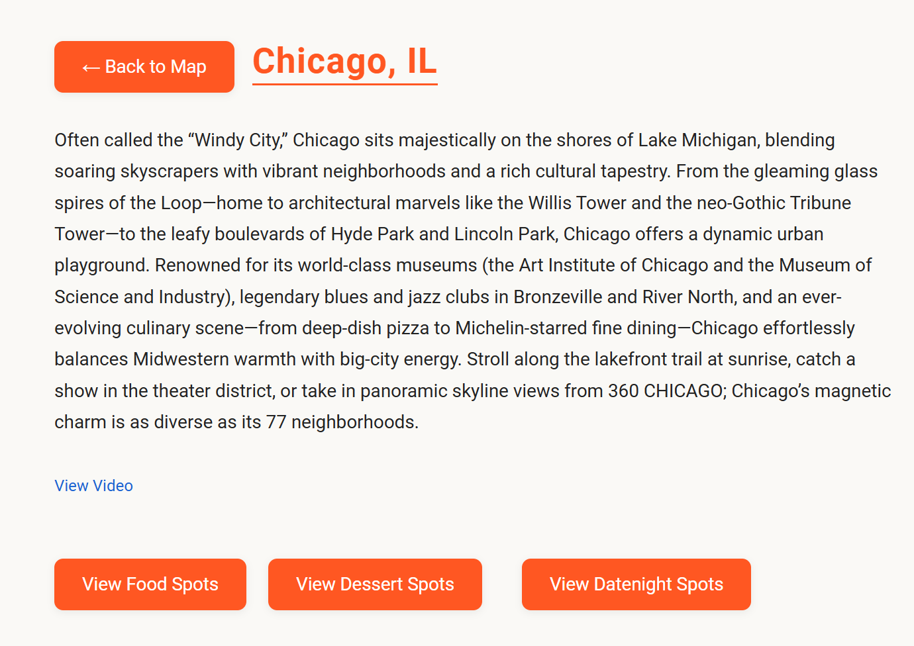

# CityTaster 🍽️

**Your one-stop shop to food, dessert, & datenight spots across the U.S.**

---

## Table of Contents
- [Overview](#overview)
- [Features](#features)
- [Screenshots](#screenshots)
- [Tech Stack](#tech-stack)
- [Project Structure](#project-structure)
- [Quickstart (Local Development)](#quickstart-local-development)
- [Production Deployment](#production-deployment)
- [Infrastructure as Code (Terraform)](#infrastructure-as-code-terraform)
- [Notable Project Files](#notable-project-files)
- [Contributing](#contributing)
- [License](#license)

---

## Overview

CityTaster is a full-stack web app that lets users browse curated lists of the best food, dessert, and date-night spots in major U.S. cities. Select a city via an interactive map to explore the top spots, read real reviews, and find essential details—all in one place.

---

## Features

- Interactive U.S. city map for easy navigation
- Curated lists for food, dessert, and date-night spots per city
- Integrated real reviews, links, and essential info
- Responsive UI (works on desktop & mobile)
- Built for easy expansion with new cities or spot types

---

## Tech Stack 
- Frontend: React, Vite, TailwindCSS, D3, React Simple Maps, Axios, Nginx (prod)

- Backend: Python Flask, PyMongo

- Database: MongoDB (Dockerized)

- Deployment: Docker Compose, Nginx, AWS (via Terraform)

- Infrastructure as Code: Terraform (EC2, S3, VPC, ECR, IAM)

- CI/CD: GitHub Actions (example, if used)

## Screenshots

| Map View                   | City Page            | Food Spots            | Dessert Spots          | Date Night Spots        |
|----------------------------|----------------------|-----------------------|------------------------|------------------------|
|  |  |  |  |  |

---

## Tech Stack

- **Frontend:** React, Vite, TailwindCSS, D3, React Simple Maps, Axios, Nginx (prod)
- **Backend:** Python Flask, PyMongo
- **Database:** MongoDB (Dockerized)
- **Deployment:** Docker Compose, Nginx, AWS (via Terraform)
- **Infrastructure as Code:** Terraform (EC2, S3, VPC, ECR, IAM)
- **CI/CD:** GitHub Actions (example, if used)

---

## Project Structure

citytaster/
├── .github/workflows #CI/CD Workflows
├── backend/ # Flask API and MongoDB models
├── frontend/ # React app (Vite, TailwindCSS)
├── deployment/ # Dockerfiles for frontend/backend
├── infra/ # Terraform IaC scripts for AWS resources
├── screenshots/ # App screenshots (for docs)
├── docker-compose.yml # Dev Compose file
├── docker-compose-prod.yml # Production Compose file
├── Makefile # Project commands
├── deploy.ps1  # Windows deployment automation
├── .gitignore  # Sensitive files excluded from git
├── README.md #README file


---

## Quickstart (Local Development)

1. **Clone the repo:**
    ```bash
    git clone https://github.com/<noob-developer25>/citytaster.git
    cd citytaster
    ```

2. **Set up environment variables:**
    - Copy `.env.example` to `.env` in the `backend/` folder and fill out required values.

3. **Start with Docker Compose:**
    ```bash
    docker compose up --build
    ```
    - The app should be available at [http://localhost:3000](http://localhost:3000).

---

## Production Deployment

1. **Build images and run using production compose:**
    ```bash
    docker compose -f docker-compose-prod.yml up -d
    ```

2. **Configure your AWS credentials** as needed.

3. **For Windows users:**  
   Use `deploy.ps1` for streamlined deployment steps:
   ```powershell
   ./deploy.ps1

## Infrastructure as Code (Terraform)
All Terraform code is in the infra/ folder:

- main.tf
- ec2.tf 
- ecr.tf
- s3.tf
- security.tf
- iam.tf
- vpc.tf 
- etc.

Notable Scripts: 
- `update.sh`: Automates pulling latest code, syncing S3 data, logging into ECR, importing CSVs to MongoDB, and redeploying 

- `user_data.sh`: Bootstraps EC2 instance (Docker, AWS CLI, git, clone, setup)

Provision AWS resources:
- cd infra
- terraform init
- terraform plan
- terraform apply
- Deploys VPC, EC2, S3, IAM roles, ECR for Docker images, and all networking.

## Notable Project Files
- `.gitignore`: Ensures sensitive files like .env, node_modules, and build artifacts are not committed
- **Makefile:** Provides shortcut commands for building, running, and managing the project  
  Examples:
    ```
    make up         # Start dev environment with Docker Compose
    make build      # Build Docker images
    make down       # Stop all containers
    ```

- **deploy.ps1:** Windows PowerShell script to automate deployment steps (prod/dev switch)
- **infra/update.sh:** Bash script for code/data sync and MongoDB import on EC2
- **infra/user_data.sh:** Bash script for EC2 provisioning, code pull, and Docker Compose start


Development Tips
- Environment Variables:
    - Never commit .env or secret keys to Git.
    - All sensitive configuration is loaded from .env (see .gitignore).

Adding new cities or spots:
- Update your MongoDB data and restart the backend container.

Expanding Infrastructure:
- Update Terraform scripts in infra/ and re-apply with terraform apply.

## Contributing
Pull requests and issues are welcome! Please open an issue first to discuss changes.

## License
MIT